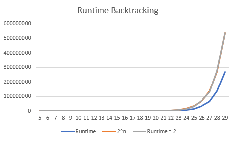

# ADS Abgabe 2
###### von Felix Kotschenreuther und Robin Bauer

## Anleitung zur Anwendung der Funktionen

### Vorbereitung
1. Platzieren Sie den Ordner samt Quelltextdateien in das selbige Laufwerk, auf dem auch das JDK installiert ist.
2. Öffnen Sie das Terminal/die Shell, gehen Sie in das Verzeichnis `ADS_Abgabe2-master/src/main/java`
3. Geben Sie folgenden Befehl ein;
       `javac knapsack.java` oder wenn Sie die ReverseString-Funktion benutzen wollen; 
   `javac reverse.java`
4. Gehen Sie in die jshell mit folgendem Befehl;
    `jshell`
5. Öffnen Sie die Klassendatei mit dem Befehl `/open knapsack.java` oder im Falle von ReverseString; `/open reverse.java`

## Rucksack nach Greedy- und Backtracking-Verfahren
Um nun die eigentliche Funktion zu verwenden, müssen Sie zuerst eine Instanz von Rucksack erstellen, der einen
Array mit den Gewichten, einen weiteren Array mit den dazugehörigen Werten, und zuletzt noch das angestrebte Maximalgewicht enthält.

Dies tun Sie mit folgendem Befehl;

`knapsack namederVariable = new knapsack(gewichteArray,werteArray,angestrebtesMaximalgewicht)`

Um nun die Backtracking-Funktion auf diese Instanz anzuwenden, geben Sie folgenden Befehl ein;

`namederVariable.backtracking()`

Ausgegeben aus dieser Funktion wird ein Integer-Array. An den entsprechenden Stellen des Arrays steht entweder eine 0 oder eine 1.

Stände an einer Stelle die 1, ist das Objekt mit demselben Index wie in der knapSack-Instanz, so ist es Teil der Sammlung der Objekte, die am nächsten am Maximalgewicht sind.

Stände an einer Stelle eine 0, so wäre das obengenannte nicht der Fall.

Auf eine gleiche Instanz kann man gleichermaßen die Greedy-Funktion anwenden. Mit dem Befehl

`namederVariable.greedyRucksack()`

wird ebenso ein Integer-Array ausgegeben, nach derselben Idee wie in der backtracking-Funktion.

## ReverseString-Funktion

Diese Funktion dreht einen gegebenen String in rückwärtiger Reihenfolge rekursiv um.

Haben Sie die reverse.java-Datei schon in der jshell geöffnet, müssen Sie zuerst eine Instanz der Klasse reverse erstellen
mit dem Befehl `reverse namederVariable = new reverse();`

Um dann einen String umzudrehen, geben Sie folgenden Befehl ein;

`namederVariable.reverse("String der umgedreht werden soll")`

Ausgegeben wird der umgedrehte String. Beachten Sie, dass mit hoher Wahrscheinlichkeit mit einer StackOverFlowException zu rechnen ist, wenn Sie einen String einsetzen wollen, der länger als 6000 Character ist.

(Geben Sie den Befehl jedoch in einer For-Schleife ein, ist erst (nach eigenen Tests) mit solchen Exceptions ab 15.000 Characters zu rechnen)

## Ausführung der Tests

Die Unittests haben wir mithilfe dem JUnit-Framework angefertigt, und können einfach über das vorliegende Gradle-Skript ausgeführt werden.

1. Gehen Sie in das Verzeichnis `/ADS_Abgabe2-master/`
2. Wenn Sie Windows benutzen, geben Sie folgenden Befehl ein; `gradlew.bat test` Wenn Sie Linux benutzen, `gradlew test`
3. Nun werden Ihnen alle Tests angezeigt und ob Sie funktionierten.

Zu den Worst-Case-Laufzeittests von Backtracking, der Worst-Case wäre, wenn der Algorithmus durch alle Werte bzw. Gewichte durchgehen müsste. Dies wäre der Fall, wenn alle Werte und Gewichte den selben Wert haben (hier 1) und das Maximalgewicht erst nachdem alle Objekte aufgenommen wurden entweder erreicht wird bzw. selbst dann immer noch nicht erreicht wird.  Daher werden die Laufzeittests mit eben solchen Arrays durchgeführt

## Berechnung der Worst-Case-Laufzeit

### Rucksack nach Backtracking-Verfahren
Im Worst-Case von jeglichen Backtracking-Verfahren liegt die Laufzeit bei _O(2^n)_, was hier nicht anders sein sollte. Die Konstante c ist ungefähr 2.

 y-Achse = Laufzeit in Millisekunden (ab Länge = 40, Laufzeit von >1 800 000 ms) x-Achse = Länge des Arrays

### Rucksack nach Greedy-Verfahren
Da an sich schon in der Regel Greedy-Verfahren eine Laufzeit von _O(n*log(n))_ haben, ist auch zu erwarten, dass dies nicht anders in dieser Funktion sein wird.

 y-Achse = Laufzeit in Millisekunden x-Achse = Länge des Arrays

### ReverseString

Rekurrenzgleichung; 
 f(n) = n+f(n-1)        wenn n>0
f(n) = 0      wenn n<=0

 y-Achse = Laufzeit in Millisekunden x-Achse = Anzahl Characters

